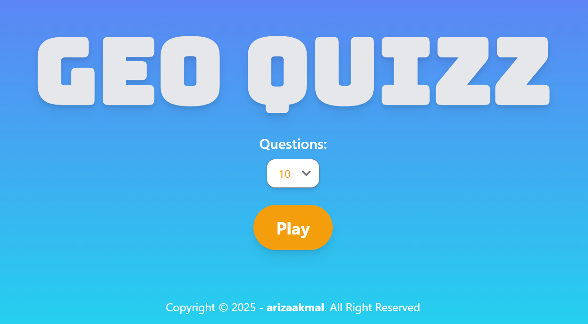

# Geo Quiz

Geo Quiz is a fun and interactive quiz application built with React. Test your knowledge on various geographical topics and see how well you score!



## Features

- Randomized questions on various geographical topics
- Animated transitions between questions
- Score tracking and display
- Sound effects for correct and incorrect answers
- Responsive design for mobile and desktop

## Getting Started

Follow these instructions to get a copy of the project up and running on your local machine for development and testing purposes.

### Prerequisites

Make sure you have the following software installed on your machine:

- [Node.js](https://nodejs.org/) (version 14 or higher)
- [npm](https://www.npmjs.com/) (version 6 or higher)
- [XAMPP](https://www.apachefriends.org/index.html) (for running the backend server)

### Installation

1. Clone the repository to your local machine:

   ```bash
   git clone https://github.com/arizaakmal/geo-quizz.git
   ```

2. Navigate into the project directory:

   ```bash
   cd geo-quizz
   ```

3. Install dependencies:

   ```bash
   npm install
   ```

### Running the Application

To start the development server, run:

```bash
npm run dev
```

The application will be available at `http://localhost:5173/`

## Technologies Used

- React
- Tailwind CSS
- Framer Motion (for animations)
- FontAwesome (for icons)
- Netlify (for deployment)

## License

This project is licensed under the MIT License.
